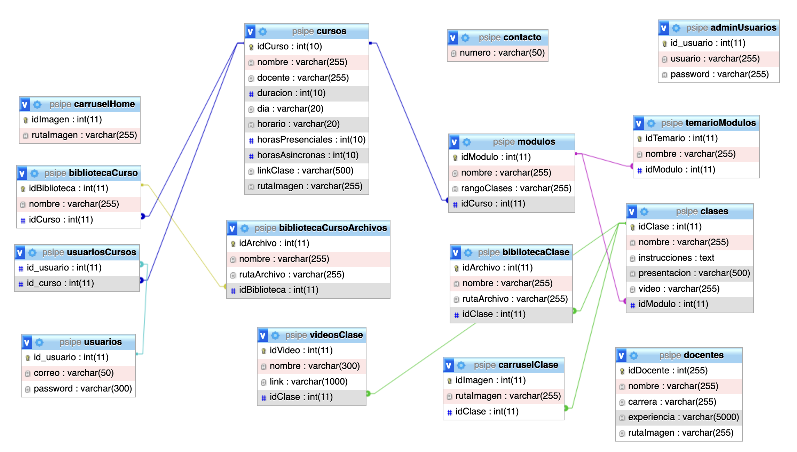

# Psipe Web Page ☮️
---
Este es el repo para la página web de Psipe. A continuación se dará una breve explicación de la estrctura de los archivos y la base de datos que alimenta el sitio web.

---
## Tecnologías utilizadas 💻
Para el desarrollo de esta aplicación se esta utilizando HTML, JS y TailwindCSS para el frontend y para el backend se esta utilizando PHP.

---
## Estructura de archivos 📁

Dentro de la carpeta *manage* se encuentran todos los archivos que corresponden al módulo de administrador.

Dentro de la carpeta *img* se encuentran las imágenes que se utilizan como assets en la página web y los directorios donde se irán guardadno las imágenes correspondientes a los elementos que se pueden modificar (carruseles, imágenes y archivos de clase, etc.) en la página desde el módulo de administrador.

Finalmente, todos los archivos que se encuentran en el directorio raíz, son los que corresponden a la parte visible de la página web (frontend, exluyendo módulo de administrador).

---

## Estructura de la base de datos


---

## Instalación del repo
1. Clonar el repositorio
```
git clone https://github.com/roblesbraun/psipe.git
```
2. Instalar dependencias
```
npm install
```

3. Correr tailwind, para aplicar estilos
```
npx tailwindcss -i ./input.css -o ./tailwind.css --watch
```
---